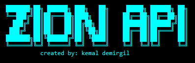

<p align = "center">  </p>

<h2 align = "center">Movie Theater API</h2>

## 💠 About:
Zion is a movie theater REST API created using `Django` and `django-rest-framework`.
It was made to:
- Create rooms with capacity
- Create movies with a play time
- Sell tickets for movie show times

## 🔧 Installation:
Clone the repository:
```
git clone https://github.com/kemaldemirgil/zion-api
```
Install pipenv for virtual environment:
```
cd zion-api/
pip install pipenv
```
Activate virtual environment:
```
pipenv shell
```
Install dependencies:
```
pipenv install django djangorestframework
```
or
```
pipenv install -r zion-api/requirements.txt
```
Start server:
```
cd zion-api/theater
python manage.py runserver
```

## 📜 Usage:
Open a browser and go to http://127.0.0.1:8000/ or use a HTTP client like **Postman**, **Insomnia**.
### API Endpoints:
- A movie needs a room & show times.
- A room needs a movie & show times.
- A room has 300 seats by default, different value can be added.
Create a show time:
> POST `http://localhost:8000/api/showtimes/`
```json
{
    "time": "8.00-11.00",
    "movie_name": {
        "name": "Kill Bill"
    },
    "room_name": {
        "name": "Room-1"
    },
    "seats": 50
}
```
Get all show times:
> GET `http://localhost:8000/api/showtimes/`
```json
{
    "id": 1,
    "movie_name": {
        "id": 1,
        "name": "Kill Bill"
    },
    "room_name": {
        "name": "Room-1",
        "show_time": [
            "Kill Bill will be playing at 8.00-11.00 with 300 capacity."
        ]
    },
    "time": "8.00-11.00",
    "seats": 50
}
```
Get a single showtime
> GET `http://localhost:8000/api/showtimes/<ID>`

Delete a showtime
> DELETE `http://localhost:8000/api/showtimes/<ID>/`

Get all rooms with showtimes
> GET `http://localhost:8000/api/rooms/`

Get a specific room
> GET `http://localhost:8000/api/rooms/?name=<ROOM_NAME>`

DELETE a room
> DELETE `http://localhost:8000/api/rooms/<ID>/`

Get all movies
> GET `http://localhost:8000/api/movies/`

DELETE a movie
> DELETE `http://localhost:8000/api/movies/<ID>/`

Get ticket for a show time
> GET `http://localhost:8000/api/get-ticket/<SHOWTIME-ID>` -> decreases show time room seats by one
  
> Movies and rooms can also be added individually however, since they would both need a show time, it's best to create them using the showtimes endpoint.

Create a movie
> POST `http://localhost:8000/api/movies/`
```json
  {
    "name": "Terminator"
  }
``` 
Create a room
> POST `http://localhost:8000/api/rooms/`
```json
  {
    "name": "Room-6"
  }
``` 

## 🧪 Tests:
```
python manage.py test
```

## 📊 Notes:
Even though this was my first time using Django and the django-rest-framework, after understanding the concepts and getting some practice using them, it was very easy to get started. The Django REST framework has awesome documentation and a very good community, it made the whole process much easier. \
\
However, I did have issues regarding reverse relationships using django serializers. After doing some research, I noticed it was a common issue and to solve it, I used the `drf-writable-nested` package. Since this was only an API-only implementation, it was difficult to do everything without using the views. I understood that I need more practice creating API's like this one. \
Since there was no views, I was limited with my testing and couldn't implement many of the ideas I had before. But I believe even though the tests aren't perfect, they should do the work for now.

## ©️ License:

Copyright © Kemal Demirgil. All rights reserved.
Licensed under the [MIT](https://github.com/kemaldemirgil/zion-api/blob/main/LICENSE) license.
